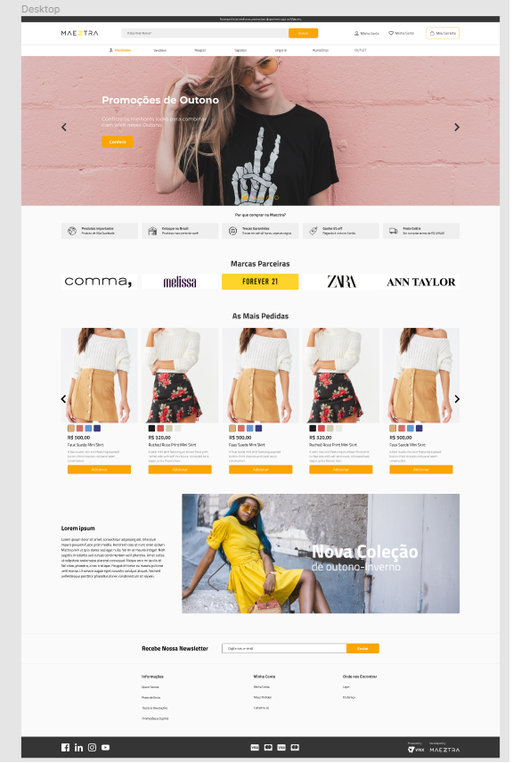

<h1 align="center"> E-COMMERCE </h1>

 

## 🚀 Tecnologias

Esse projeto foi desenvolvido com as seguintes tecnologias:

- HTML, CSS e SASS
- JavaScript - JQuery 
 

## 💻 Projeto

Pagina fictícia de um E-Commerce utilizando os melhores métodos e tecnologias em sua construção. 
*Projeto feito no programa de estágio "Next-Level" da [Maeztra](https://maeztra.com/)*

  

## 🔖 Layout

*Você pode visualizar o layout do projeto através [DESSE LINK]( https://www.figma.com/file/3RqPfS5PW9whbQNCTTaoqA/%5B2020-09%5D-MZ---Layout-Teste-de-vagas-para-time-de-Devs). É necessário ter conta no [Figma](https://figma.com) para acessá-lo.*
